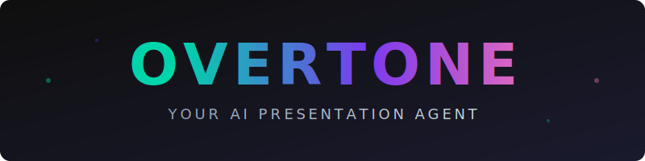

<div align="center">



[](https://python.org)
[](https://fastapi.tiangolo.com)
[](https://react.dev)
[](https://azure.microsoft.com)
[]()

**Upload a deck. Paste a meeting link. Overtone joins, presents, and fields questions — live.**

[Setup Guide](docs/setup-guide.md) | [Technical Docs](docs/project-summary.md) | [API Docs (local)](http://localhost:8000/docs)

</div>

---

## What is Overtone?

Overtone is an **autonomous presentation agent** that joins video meetings as a real participant. It renders your slide deck as its camera feed, narrates each slide with natural speech, and engages in live Q&A with the audience — answering questions by searching the deck, navigating to the right slide, and speaking answers drawn **entirely from your actual slide content**.

No hallucination. No training data leakage. Every word the agent speaks is grounded in what's on the slides.

It uses a **direct speech-to-speech pipeline**: raw audio flows in, the model reasons over it, and spoken audio flows back out. There is no intermediate transcription step, no separate LLM call, no separate TTS call. This is what makes sub-3-second response times possible in a live meeting setting.

### Key Capabilities

- **Autonomous presentation** — Narrates slides sequentially with natural speech, advancing through the deck without manual control
- **Real-time Q&A** — Audience members can interrupt with questions at any time; the agent searches the deck, navigates to the right slide, and answers conversationally
- **Hybrid retrieval** — Combines keyword search, vector similarity (3072-dim embeddings across content, titles, and pre-generated Q&A pairs), and structural metadata matching for accurate slide selection
- **Grounded responses** — Every spoken answer is derived exclusively from the slide content returned by the retrieval system; a non-negotiable grounding law prevents the model from supplementing with external knowledge
- **Filler audio** — Pre-recorded acknowledgment phrases play instantly when a search begins, eliminating dead air while retrieval runs in parallel
- **Multi-platform** — Works with Google Meet, Zoom, and Microsoft Teams

### How It Works (High Level)

```
┌──────────────┐     ┌──────────────────┐     ┌───────────────────┐
│   Meeting    │     │   Overtone       │     │   Speech-to-      │
│   Platform   │◄───►│   Backend        │◄───►│   Speech Model    │
│ (Meet/Zoom)  │     │   (FastAPI)      │     │   (Realtime API)  │
└──────┬───────┘     └────────┬─────────┘     └───────────────────┘
       │                      │
       │  Bot joins as        │  Tool calls executed
       │  participant with    │  server-side:
       │  slide deck as       │  ┌─────────────────────────┐
       │  camera feed         │  │  search_and_answer      │
       │                      │  │  → Hybrid RAG search    │
       │  Audience speaks     │  │  → Navigate to slide    │
       │  → raw audio in      │  │  → Return content       │
       │                      │  │                         │
       │  Agent speaks        │  │  navigate_to_slide      │
       │  ← audio out         │  │  → Direct page jump     │
       │                      │  │  → Return content       │
       └──────────────────────┘  └─────────────────────────┘
```

**The voice pipeline is fully streaming and bidirectional.** Audio from the meeting flows through a WebSocket relay to the speech model. The model processes speech natively — understanding intent, deciding whether to call a tool or respond directly, and generating spoken output — all in a single pass. Tool calls (search, navigation) are intercepted and executed server-side by the backend; the frontend never sees them.

---

## Features

### Presentation Intelligence

| Feature | Description |
|---------|-------------|
| **Vision-based indexing** | Every slide is analyzed by a vision model that extracts structured metadata: title, section label, description, entities, table data, chart descriptions, diagram structure, and a dense searchable paragraph |
| **17 fields per slide** | Each page produces a rich metadata record including `questions_answered` — 4-6 anticipated audience questions per slide, used for question-to-question retrieval matching |
| **Three vector indexes** | Content, title, and Q&A embeddings (3072 dimensions each) enable retrieval from multiple semantic angles simultaneously |
| **Manifest-first routing** | Structural queries ("show me pricing", "go to case studies") are resolved instantly from the deck's table of contents — no search API call needed |

### Voice Interaction

| Feature | Description |
|---------|-------------|
| **Speech-to-speech** | Direct audio pipeline with no intermediate transcription; the model reasons over raw speech |
| **Sub-3s responses** | End-to-end from user speech to agent speech: ~500ms VAD + ~350ms embedding + ~300ms search + ~500ms speech generation |
| **Filler audio** | 10 pre-recorded acknowledgment phrases play instantly when a tool call starts, bridging the retrieval gap with natural speech |
| **Server-side tool execution** | All RAG search and navigation logic runs on the backend; the model's function calls never reach the client |
| **Grounding enforcement** | System prompt includes a non-negotiable grounding law: the agent can only speak from retrieved slide content |

### Presentation Modes

| Mode | Behavior |
|------|----------|
| **Auto-present** | Agent narrates slides 1 through N sequentially. Advances to the next slide when the audience speaks. Handles interruptions gracefully — answers the question, then resumes. After slide N, transitions to Q&A. |
| **Q&A only** | Agent waits silently for questions. Searches the deck, navigates to the relevant slide, answers, then asks for more questions. |

### Admin Dashboard

- Upload PDF or PPTX presentations with automatic indexing
- Create and version agent profiles with custom system prompts
- Launch bots into meetings with configurable presentation and mode
- Monitor active sessions, relay health, and latency metrics

---

## Architecture

```
overtone/
├── backend/                 Python 3.11, FastAPI
│   ├── api/                 REST endpoints, WebSocket relay, bot launcher
│   ├── agents/              System prompt composition and guardrails
│   ├── indexer/             PDF conversion, vision extraction, embedding, search indexing
│   ├── orchestrator/        RAG retriever, tool executor, WebSocket room manager
│   ├── services/            Search client, blob storage, filler audio, session store
│   └── static/fillers/      Pre-recorded filler MP3 clips
│
├── frontend/                React + Vite (presentation output)
│   └── src/
│       ├── hooks/           Realtime agent, presentation transport, slide navigation
│       └── components/      SlideViewer, PresentationStage, StatusIndicator
│
├── dashboard/               React + Vite (admin UI)
│   └── src/
│       ├── pages/           Launch, Agents, Presentations
│       └── components/      BotConfigForm, AgentEditor
│
└── docs/
    ├── setup-guide.md       Step-by-step local setup, troubleshooting, API reference
    └── project-summary.md   Full technical deep-dive
```

### Dual WebSocket Design

Every active session maintains two independent WebSocket connections:

| Connection | Path | Purpose |
|-----------|------|---------|
| **Realtime Audio** | `/ws/realtime/{session_id}` | Bidirectional PCM16 audio streaming between the browser and the speech model, proxied through the backend relay |
| **Presentation Transport** | `/ws/presentation/{session_id}` | Server → client commands: slide navigation, filler audio delivery, status updates |

The relay intercepts all tool-related events from the speech model and strips them before forwarding to the browser. The frontend is a pure audio player + slide renderer — it has no knowledge of RAG, tool calls, or search logic.

### Retrieval Pipeline

When a user asks a content question, the retrieval system executes in this order:

1. **Manifest check** — word overlap against section labels and page titles (instant, no API call)
2. **Query embedding** — 3072-dimension vector via embedding model
3. **Hybrid search** — simultaneous keyword + vector search across content, title, and Q&A vector fields; results fused via Reciprocal Rank Fusion
4. **Re-ranking** — title boost (+4.0 per matching term), section boost (+2.0), keyword frequency scoring
5. **Navigation** — slide change broadcast to frontend via presentation WebSocket
6. **Content delivery** — up to 1500 characters of slide text returned to the model with grounding instructions

---

## Quick Start

### Prerequisites

```bash
# macOS
brew install python@3.11 node poppler cloudflared
brew install --cask libreoffice
```

### Install

```bash
git clone https://github.com/abhanu1998/overtone.git
cd overtone

# Backend
cd backend && python3.11 -m venv .venv && source .venv/bin/activate && pip install -r requirements.txt && cd ..

# Frontend + Dashboard
cd frontend && npm install && cd ..
cd dashboard && npm install && cd ..
```

### Configure

```bash
cp backend/.env.example backend/.env
```

Edit `backend/.env` with your API keys. See `backend/.env.example` for the full list of configuration options.

**Required services:**

| Key | Source |
|-----|--------|
| `RECALL_API_KEY` | Meeting bot platform API key |
| `OPENAI_API_KEY` | Speech model + embeddings API key |
| `ANTHROPIC_API_KEY` | Vision extraction model API key |
| `AZURE_SEARCH_ENDPOINT` | Search service endpoint URL |
| `AZURE_SEARCH_KEY` | Search service admin key |
| `AZURE_BLOB_ACCOUNT_URL` | Blob storage account URL |
| `AZURE_BLOB_ACCOUNT_KEY` | Blob storage account key |
| `ADMIN_API_KEY` | Any random string (authenticates dashboard API calls) |

### Run

```bash
./start-local.sh
```

Opens the dashboard at **http://localhost:5174**. Upload a deck, paste a meeting link, launch.

### Run without meeting integration

```bash
cd backend && source .venv/bin/activate && uvicorn main:app --host 0.0.0.0 --port 8000 --reload
cd frontend && npm run dev     # port 5173
cd dashboard && npm run dev    # port 5174
```

---

## Documentation

| Document | Description |
|----------|-------------|
| [docs/setup-guide.md](docs/setup-guide.md) | Complete setup walkthrough — prerequisites, environment configuration, Azure setup, launching bots, troubleshooting, log patterns, and API reference |
| [docs/project-summary.md](docs/project-summary.md) | Full technical specification — voice pipeline, tool orchestration, indexing pipeline, retrieval scoring, WebSocket architecture, auto-present logic, known issues, and next steps |

---

## Contributing

See [docs/project-summary.md](docs/project-summary.md) for the full system context, known issues, and planned improvements before making changes.

## License

Proprietary. All rights reserved.
