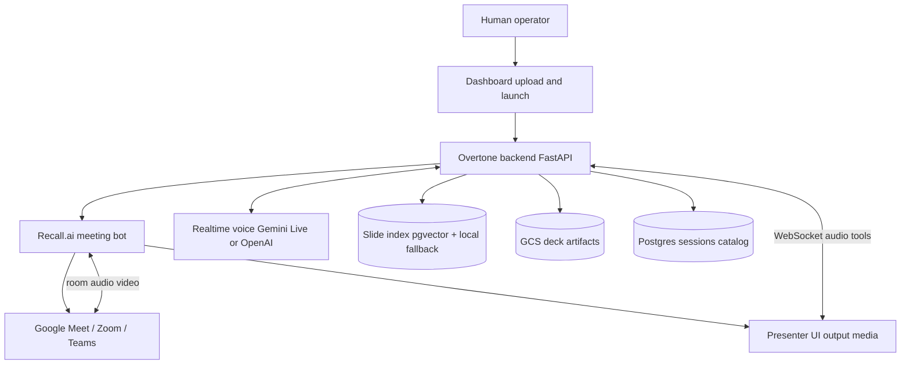
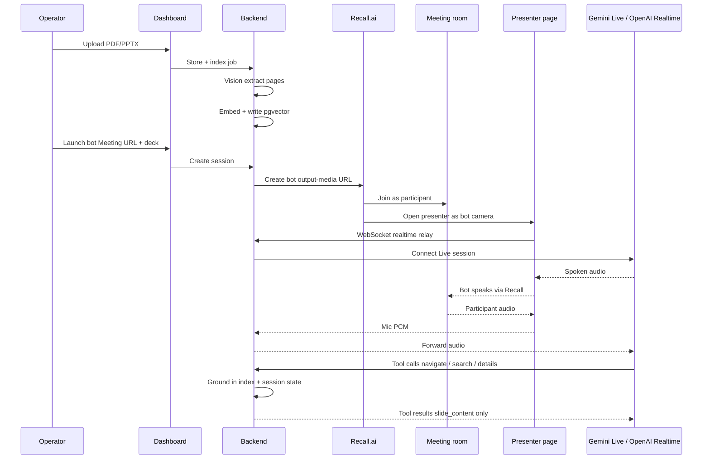
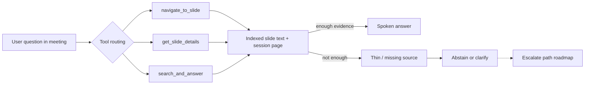
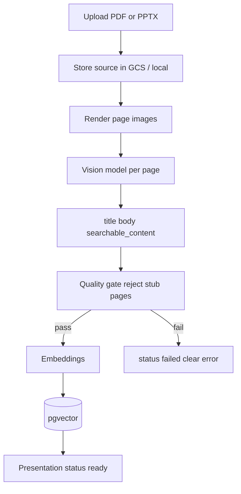

# Overtone — Architecture Overview

**Audience:** technical discussion (meeting join + live grounding)  
**Status:** under active development — demo / architecture stage, not a finished compliance product  
**Date:** August 2026

---

## One-line framing

Overtone is a **live meeting layer**: a bot joins Google Meet / Zoom / Teams as a participant, presents a deck, listens with realtime speech-to-speech, and answers from **indexed session sources** — with a design goal to **abstain or escalate** when grounding is weak (not invent).

It is **not** a finished “zero-hallucination guarantee” product. The honest framing is: **traceable, source-bound outputs + hard stop when the source cannot support an answer.**

---

## System context

---

## Session lifecycle

---

## Layers

| Layer | What it does | Tech (current) |
|---|---|---|
| Capture / join | Bot enters the call as a participant; camera shows slides | Recall.ai |
| Presenter | Deck UI, mic capture, plays bot audio | React (output-media webpage) |
| Realtime voice | Speech-to-speech + tool calling | Gemini Live (preferred) / OpenAI Realtime |
| Orchestration | Session state, tools, mute, page position | FastAPI relay + tool executor |
| Grounding | Per-slide text/metadata retrieval | Vision extract → embeddings → pgvector |
| Persistence | Dec files, catalog, session extras | GCS + Postgres |

---

## Grounding path (answer only from sources)

**Design principle (aligned with escalate-don’t-guess):**

1. Prefer the **currently visible slide** for “explain this / what’s on this.”
2. Search the **deck index** before any external lookup.
3. If retrieval is empty or stub-thin → **do not invent**; clarify or say it is not in source.
4. **Human escalate** (expert as ground truth) is the intended next architectural step for professional-services grade use — not claimed as fully shipped today.

---

## Indexing pipeline

Vision stubs like title-only `"Slide 4"` must not be marked ready — that is a known failure mode we gate against.

---

## Realtime tools (meeting actions)

| Tool | Role |
|---|---|
| `navigate_to_slide` | Jump to a page; persist `current_page` |
| `get_slide_details` | Narrate the current (or specified) page from index |
| `search_and_answer` | Hybrid retrieve over slides (+ optional briefing); stay or navigate |
| `mute_self` / `unmute_self` | Hard silence path |
| `leave_call` | Explicit exit only |
| `fetch_external_data` | Last resort; not for on-deck questions |

Spoken answers are instructed to come from **tool results** (`slide_content` / `brief_content`), not model memory.

---

## Session durability (demo / single-instance)

For live Meet demos, the API runs with **sticky single-instance** so WebSockets (presenter + relay) stay on one process.

Durable session flags (greeting already sent, muted, current page) are merged into session `extra` and mirrored to SQL so reconnects do not re-greet or lose page context.

---

## What is solid vs what is next

**Solid enough to show**

- Join Meet as participant via Recall  
- Present deck as bot camera  
- Realtime voice in/out  
- Tool-grounded slide Q&A  
- Index quality gate for empty Vision stubs  

**Explicit next (honest roadmap)**

- First-class **escalate-to-human** queue (expert answer becomes ground truth)  
- Stronger **confidence / abstention** policy at tool boundary  
- Multi-instance WS fan-out (Redis pub/sub) if scale beyond one API instance  
- Audit trail of claim → source chunk for compliance-style review  

---

## How this relates to a digital protégé product

| Protégé concern | Overtone role |
|---|---|
| Join Meet/Zoom as participant | Meeting adapter (today’s focus of this demo) |
| Follow conversation without guessing | Session + deck grounding + abstain |
| Respond when addressed | Realtime voice + tools |
| Escalate when unsure | Architectural fit — to align with expert KB / human handoff |

Overtone is best understood as a **live meeting adapter + grounding shell**, not a replacement for an expert-judgment knowledge system.

---

## Contact / demo note

This document describes the **current engineering architecture** of Overtone as of the date above. Capabilities labeled roadmap are intentional design direction, not production guarantees.
